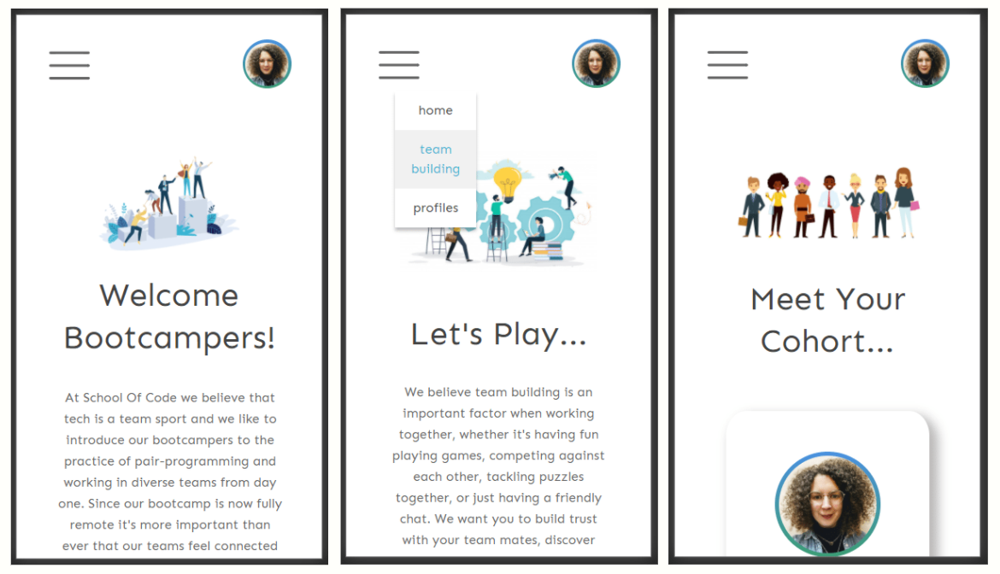
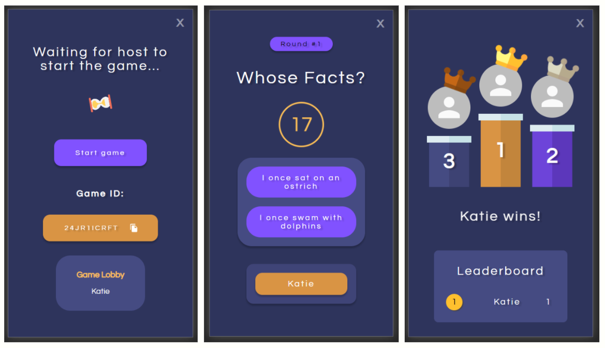
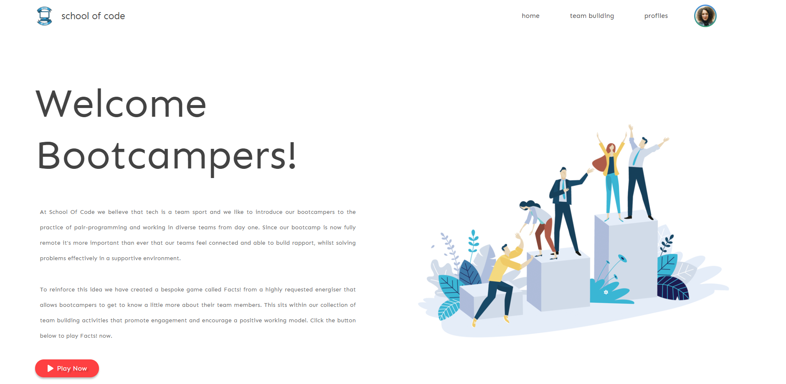
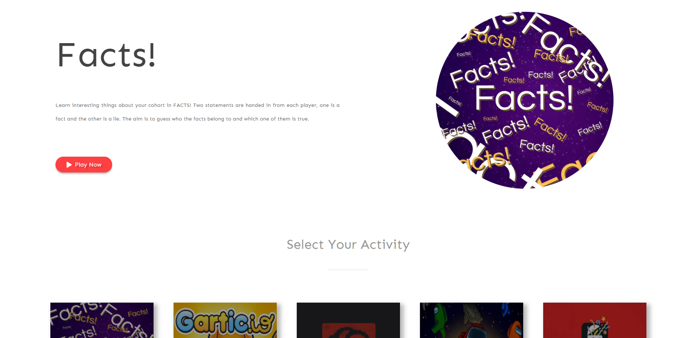
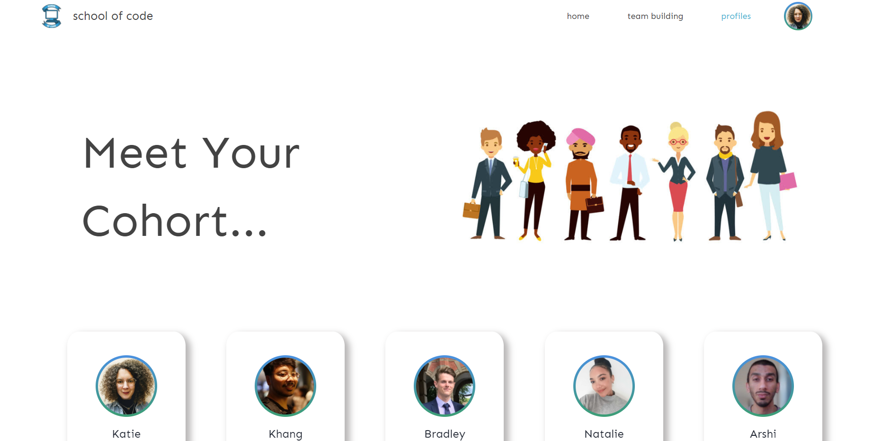
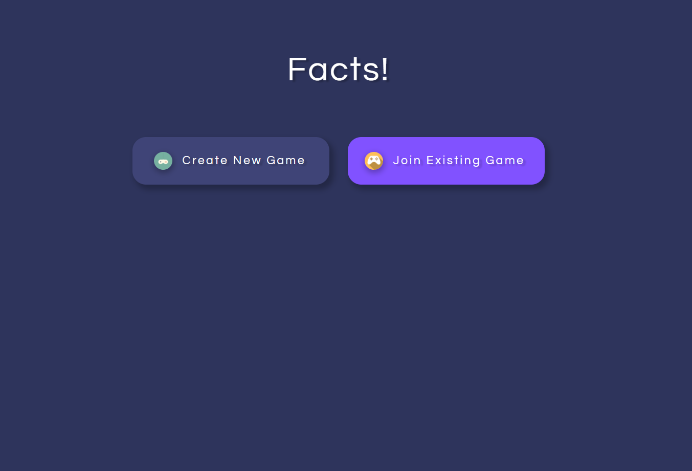
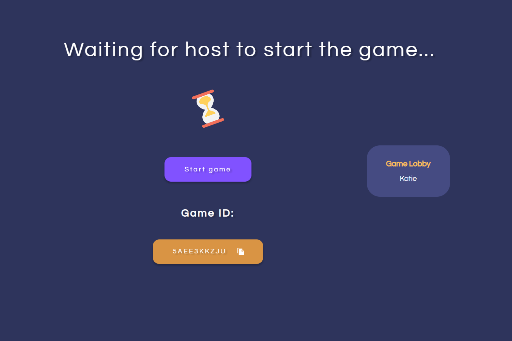
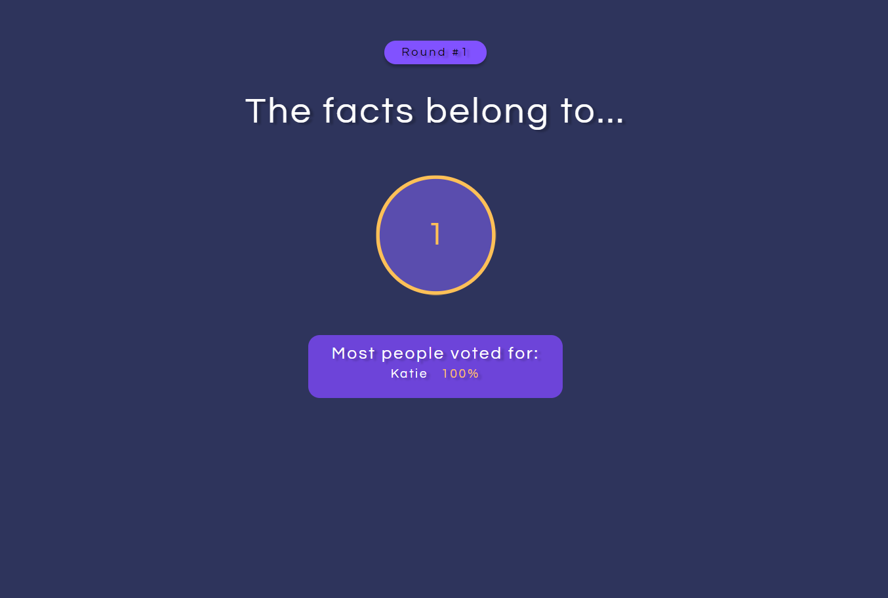
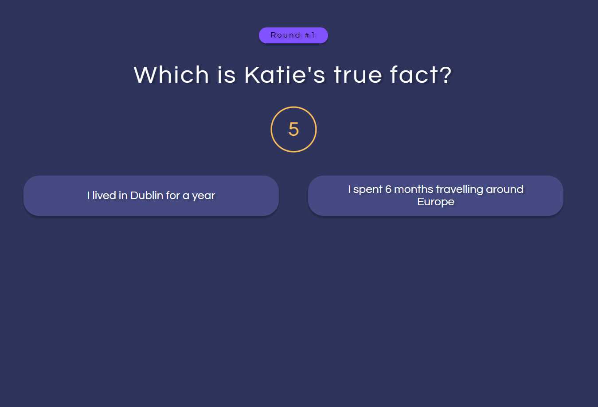

# Team Building Platform featuring bespoke Facts! game

## Team Paragon - School of Code Final Project

##### December 2020 - January 2021 (4 week project)

## Our Brief

"To improve the remote team building experience at the School of Code"

## Current challenges with remote team building

-   Getting to know people on a personal level remotely
-   Lack of non-work social interactions
-   Having down time with colleagues during the bootcamp

## Our Solution

After conducting user research and reflecting on our own experiences, we
chose to solve the problem by creating a bespoke game (Facts!) which helps people to get to know each other and work together more effectively. Alongside this we created a platform designed specifically for the School of Code which contains team member profiles and an activities library which encourages bootcampers to spend time building rapport in a non-work context. These two services allow team members to learn more about each other, work together and share a positive experience, which will ultimately result in more effective teamwork.

## Project details

A React front-end interacts in real-time with backend components using websockets. In-game persistence was achieved using AWS DynamoDB, with authentication and authorisation handled by AWS Cognito.

Draw.io was used to construct the initial wireframes and logical flow of both the game and platform, before creating high fidelity prototypes with Figma. Storybook allowed us to visually test each component in isolation during development.

Built in just four weeks by a fully remote team, we managed our workflow using Jira and implemented Agile methodology using a Scrumban framework with weekly
sprints, daily stand up’s and retros, and regular client reviews.

Both the platform and game are fully responsive and have been designed for both desktop and mobile.

### Mobile Views

## Tech stack:

HTML5, CSS3, JavaScript, React, Node.js, Websockets, AWS DynamoDB, AWS Cognito, Storybook, Material UI, Jest, React Testing Library, Figma, Jira, Confluence. Cloud hosted using Heroku and Netlify.

### For more information and about this project and how we built it [please view our product presentation and demo here](https://youtu.be/0dfBA3KpZv8).

## Team Building Platform

### Home page

### Team Building page

### Bootcamper Profiles page

## Facts! game

### Facts! Landing page

### Facts! Game Lobby page

### Facts! Whose Fact Reveal Countdown page

### Facts! Which Fact Is True? page

